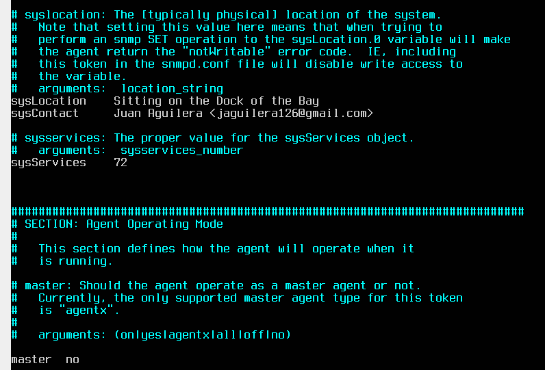
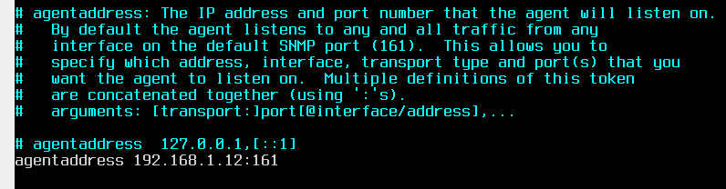
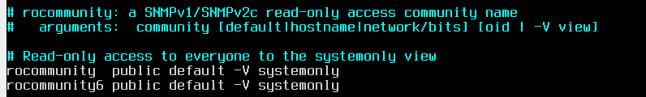
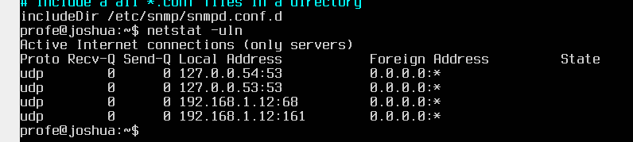
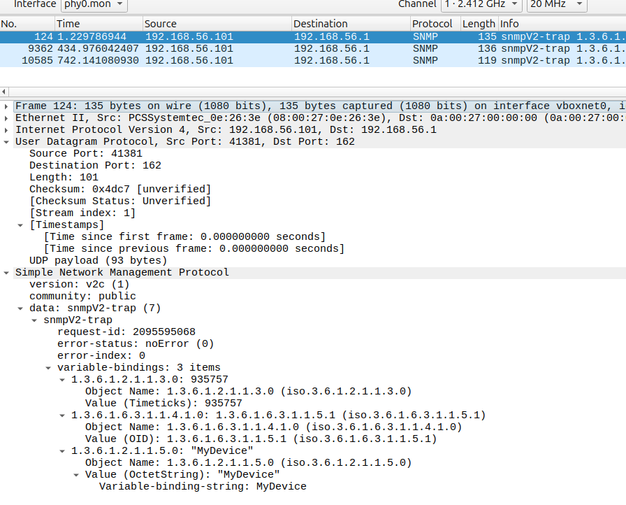

# Python-snmp
Apunts i proves sobre l'ús de llibreries Python per implementar el protocol SNMP.

## Recursos
[SNMP MIBs & SNMP OIDs explained](https://www.comparitech.com/net-admin/snmp-mibs-oids-explained/)

[Buscador de MIBs](https://mibbrowser.online/mibdb_search.php)

[OIDs de Linux](http://www.debianadmin.com/linux-snmp-oids-for-cpumemory-and-disk-statistics.html)

[SNMP a Linux](https://nsrc.org/workshops/2021/afnog-nme/netmgmt/en/snmp/exercises-snmp.htm)

[snmptrap collector](https://github.com/n0braist/snmp_trap_collector)

[SNMP Library for Python 7.1.16](https://docs.lextudio.com/pysnmp/v7.1/docs/)

## Test: Comandes per fer consultes. Linux as an agent

### Linux as an agent

#### Pas 1. Configurem el dimoni snmpd

He instal·lat el paquet `snmpd` en una màquina vuirtual Ubuntu Server 24.04 i he modificat algun paràmetre de la configuració per a que poguès escoltar peticions de la xarxa local.





He afegit a ferro la ip per la que vull que escolti l'agent. També puc afegir la línea 

```bash
agentaddress UDP:161
```

això farà que escolti per totes les interfícies en el port udp 161.

Després, vaig a afegir la següent línea per poder veure la taula d'interfícies:

```bash
###########################################################################
# SECTION: Access Control Setup
#
#   This section defines who is allowed to talk to your running
#   snmp agent.

# Views 
#   arguments viewname included [oid]

#  system + hrSystem groups only
view   systemonly  included   .1.3.6.1.2.1.1
view   systemonly  included   .1.3.6.1.2.1.25.1
#  Juan - afegeixo taula d'interfícies
view   systemonly  included   .1.3.6.1.2.1.2
```

Si el que vull és poder veure-ho tot (per fer proves, per exemple), he de reemplaçar aquestes directives `view` per aquesta altra:

```bash
view   allview    included   .1
```

i reemplaçar la directiva `rocommunity` per 

```bash
rocommunity  public  default -V allview
```

Vaig a fer proves de moment amb SNMPv1 i SNMPv2c en mode només lectura:



Finalment, fem un `$ sudo systemctl restart snmpd.service`.



#### Pas 2. Instal·lem i configurem el client

```bash
$ sudo apt install snmp
```

Aquest paquet et permet de fer consultes a un agent. Si volem treballar amb noms i no directament amb OID, hem d'instal·lar també els MiB en el client, de cara a poder tenir l'estructura de la base de dades i els noms simbòlics dels objectes (OID) de la taula:

```bash
$ sudo apt install snmp-mibs-downloader
```

I comentar també la directiva `mibs` a `/etc/snmp/snmp.conf`:

```bash
# mibs: 
```

### Taula vs branca a OID

Una branca és qualsevol subnivell dins de l'OID jeràrquic i taula és una estructura de fil·les i columnes dins d'una branca. Per exemple, la taula `ifTable` (1.3.6.1.2.1.2.2), que té tantes fil·les com interfícies (en el cas de més avall, 3 interfícies), i que per columnes, té, per exemple:

* `ifIndex - 1.3.6.1.2.1.2.2.1.1`
* `ifDescr - 1.3.6.1.2.1.2.2.1.2`
* `ifType  - 1.3.6.1.2.1.2.2.1.3`


### Exemple de comandes del paquet SNMP de Linux

Implementa operacions `SNMP`.

Totes les comandes tenen unes opcions genèriques d'entrada i de sortida (OID input, `-I`; OID output, `-O`) que es descriuen al manual de `snmpcmd` (`man snmpcmd`).

#### snmpget

Demano el valor escalar de sysUpTime traient el tipus de format (`-OQ`)

```bash
$ snmpget -v2C -c public 192.168.56.101 -OQ sysUpTime.0
DISMAN-EVENT-MIB::sysUpTimeInstance = 0:0:31:15.06
```

Sense l'opció:

```bash
$ snmpget -v2C -c public 192.168.56.101 sysUpTime.0
DISMAN-EVENT-MIB::sysUpTimeInstance = Timeticks: (307481) 0:51:14.81
```

#### snmpgetnext

Implementa la consulta `GETNEXT`, que el que fa és retornar-te el valor del següent OID en ordre lexicogràfic.

```bash
joan@super-ThinkBook-14-G4-IAP:~$ snmpgetnext -v2c -c public 192.168.56.101 sysUpTime.0
SNMPv2-MIB::sysContact.0 = STRING: Juan Aguilera <jaguilera126@gmail.com>
```

En l'exemple li he passat el sysUpTime i m'ha retornat el sysContact.

Si el valor del següent OID és una taula, retornarà el valor de la primea fil·la i columna d'aquesta taula.

#### snmpwalk

Recorre taules i branques. Ho fa fent servir peticions de tipus `snmpgetnext`.

`snmpwalk` - recorre tota una branca de OIDs.

1. Llistat de totes les interfícies d'un agent (en aquest cas, Linux):

```bash
$ joan@super-ThinkBook-14-G4-IAP:~$ snmpwalk -v2c -c public 192.168.56.101 1.3.6.1.2.1.2.2.1.2
IF-MIB::ifDescr.1 = STRING: lo
IF-MIB::ifDescr.2 = STRING: enp0s3
IF-MIB::ifDescr.3 = STRING: enp0s8
```

2. Llistat de tota la branca/taula d'interfícies:

```bash
$ snmpwalk -v2c -c public 192.168.56.101 1.3.6.1.2.1.2.2
IF-MIB::ifNumber.0 = INTEGER: 3
IF-MIB::ifIndex.1 = INTEGER: 1
IF-MIB::ifIndex.2 = INTEGER: 2
IF-MIB::ifIndex.3 = INTEGER: 3
IF-MIB::ifDescr.1 = STRING: lo
IF-MIB::ifDescr.2 = STRING: enp0s3
IF-MIB::ifDescr.3 = STRING: enp0s8
IF-MIB::ifType.1 = INTEGER: softwareLoopback(24)
IF-MIB::ifType.2 = INTEGER: ethernetCsmacd(6)
IF-MIB::ifType.3 = INTEGER: ethernetCsmacd(6)
IF-MIB::ifMtu.1 = INTEGER: 65536
IF-MIB::ifMtu.2 = INTEGER: 1500
IF-MIB::ifMtu.3 = INTEGER: 1500
IF-MIB::ifSpeed.1 = Gauge32: 10000000
IF-MIB::ifSpeed.2 = Gauge32: 1000000000
IF-MIB::ifSpeed.3 = Gauge32: 1000000000
IF-MIB::ifPhysAddress.1 = STRING: 
IF-MIB::ifPhysAddress.2 = STRING: 8:0:27:e:26:3e
IF-MIB::ifPhysAddress.3 = STRING: 8:0:27:ca:45:f2
IF-MIB::ifAdminStatus.1 = INTEGER: up(1)
IF-MIB::ifAdminStatus.2 = INTEGER: up(1)
IF-MIB::ifAdminStatus.3 = INTEGER: up(1)
IF-MIB::ifOperStatus.1 = INTEGER: up(1)
IF-MIB::ifOperStatus.2 = INTEGER: up(1)
IF-MIB::ifOperStatus.3 = INTEGER: up(1)
IF-MIB::ifLastChange.1 = Timeticks: (0) 0:00:00.00
IF-MIB::ifLastChange.2 = Timeticks: (802075) 2:13:40.75
IF-MIB::ifLastChange.3 = Timeticks: (0) 0:00:00.00
IF-MIB::ifInOctets.1 = Counter32: 28946
IF-MIB::ifInOctets.2 = Counter32: 5850598
IF-MIB::ifInOctets.3 = Counter32: 29417
IF-MIB::ifInUcastPkts.1 = Counter32: 342
IF-MIB::ifInUcastPkts.2 = Counter32: 60926
IF-MIB::ifInUcastPkts.3 = Counter32: 191
IF-MIB::ifInNUcastPkts.1 = Counter32: 0
IF-MIB::ifInNUcastPkts.2 = Counter32: 0
IF-MIB::ifInNUcastPkts.3 = Counter32: 0
IF-MIB::ifInDiscards.1 = Counter32: 0
IF-MIB::ifInDiscards.2 = Counter32: 0
IF-MIB::ifInDiscards.3 = Counter32: 0
IF-MIB::ifInErrors.1 = Counter32: 0
IF-MIB::ifInErrors.2 = Counter32: 0
IF-MIB::ifInErrors.3 = Counter32: 0
IF-MIB::ifInUnknownProtos.1 = Counter32: 0
IF-MIB::ifInUnknownProtos.2 = Counter32: 0
IF-MIB::ifInUnknownProtos.3 = Counter32: 0
IF-MIB::ifOutOctets.1 = Counter32: 28946
IF-MIB::ifOutOctets.2 = Counter32: 6176354
IF-MIB::ifOutOctets.3 = Counter32: 19507
IF-MIB::ifOutUcastPkts.1 = Counter32: 342
IF-MIB::ifOutUcastPkts.2 = Counter32: 60976
IF-MIB::ifOutUcastPkts.3 = Counter32: 216
IF-MIB::ifOutNUcastPkts.1 = Counter32: 0
IF-MIB::ifOutNUcastPkts.2 = Counter32: 0
IF-MIB::ifOutNUcastPkts.3 = Counter32: 0
IF-MIB::ifOutDiscards.1 = Counter32: 0
IF-MIB::ifOutDiscards.2 = Counter32: 0
IF-MIB::ifOutDiscards.3 = Counter32: 0
IF-MIB::ifOutErrors.1 = Counter32: 0
IF-MIB::ifOutErrors.2 = Counter32: 0
IF-MIB::ifOutErrors.3 = Counter32: 0
IF-MIB::ifOutQLen.1 = Gauge32: 0
IF-MIB::ifOutQLen.2 = Gauge32: 0
IF-MIB::ifOutQLen.3 = Gauge32: 0
IF-MIB::ifSpecific.1 = OID: SNMPv2-SMI::zeroDotZero
IF-MIB::ifSpecific.2 = OID: SNMPv2-SMI::zeroDotZero
IF-MIB::ifSpecific.3 = OID: SNMPv2-SMI::zeroDotZero
```

#### snmpbulkget

Serveix per demanar més d'una variable OID en una petició. Es poden demanar en la mateixa petició valors escalars (non-repeaters) i valors que estan continguts en taules. Exemple de crida: 

`snmpbulkget -v2c -c public -Cn2 -Cr9 192.168.56.101 1.3.6.1.2.1.1.3 1.3.6.1.2.1.1.5 1.3.6.1.2.1.2.2`. 

Apareixen dos paràmetres nous: `-Cn`, per especificar el nombre de variables non-repeaters que es demanen, i `-Cr` per especificar els valors que es volen obtenir d'una taula. Després d'aquestes opcions apareixen els OID que es volen recollir. En l'exemple, els dos primers seràn els escalars i el tercer OID és una taula (la taula d'interfícies `ifTable`) de la qual es volen agafar 9 valors.

```bash
joan@super-ThinkBook-14-G4-IAP:~$ snmpbulkget -v2c -c public -Cn2 -Cr9 192.168.56.101 1.3.6.1.2.1.1.3 1.3.6.1.2.1.1.5 1.3.6.1.2.1.2.2
DISMAN-EVENT-MIB::sysUpTimeInstance = Timeticks: (145445) 0:24:14.45
SNMPv2-MIB::sysName.0 = STRING: joshua
IF-MIB::ifIndex.1 = INTEGER: 1
IF-MIB::ifIndex.2 = INTEGER: 2
IF-MIB::ifIndex.3 = INTEGER: 3
IF-MIB::ifDescr.1 = STRING: lo
IF-MIB::ifDescr.2 = STRING: enp0s3
IF-MIB::ifDescr.3 = STRING: enp0s8
IF-MIB::ifType.1 = INTEGER: softwareLoopback(24)
IF-MIB::ifType.2 = INTEGER: ethernetCsmacd(6)
IF-MIB::ifType.3 = INTEGER: ethernetCsmacd(6)
```

#### snmpbulkwalk

Igual que `snmpwalk` però més eficient ja que ho fa amb peticions `GETBULK`. Com que les peticions `GETBULK` són a partir de la versió SNMPv2c, haurem de fer servir `snmpwalk` si estem en la versió 1.

#### snmpset

Implementa la petició `SNMP SET` per modificar valors OID. Pots modificar més d'un OID en la mateixa petició. En la sintaxi has d'indicar l'OID, el tipus de valor i el nou valor de l'OID. Segons `man snmpset`:

```bash
SYNOPSIS
       snmpset [COMMON OPTIONS] AGENT OID TYPE VALUE [OID TYPE VALUE]...
```
```bash
       The TYPE is a single character, one of:
              i  INTEGER
              u  UNSIGNED
              s  STRING
              x  HEX STRING
              d  DECIMAL STRING
              n  NULLOBJ
              o  OBJID
              t  TIMETICKS
              a  IPADDRESS
              b  BITS
```

Si en el client tenim carregat l'esquema del MIB al que referenciem en el snmpset podem ficar el signe `=` en comptes del tipus.

Exemple. Vaig a canviar les dades de contacte de l'agent:

```bash
joan@super-ThinkBook-14-G4-IAP:~$ snmpset -v2c -c public 192.168.56.101 system.sysContact.0 s "Pedro Picapiedra <pedrowillma@gmail.com>"
Error in packet.
Reason: noAccess
Failed object: SNMPv2-MIB::sysContact.0
```

Vaja. No m'ha deixat. Això és perque la cadena de comunitat que estic fent servir (*public*) és de lectura només. Si vaig al fitxer de configuració de l'agent (`rocommunity  public  default -V allview`):

```bash
rocommunity  public  default -V allview
```

He de crear una altra cadena per lectura i escriptura:

```bash
rocommunity  public  default -V allview
rwcommunity  private  default -V allview
```

I reinicio l'agent:

```bash
profe@joshua:~$ systemctl restart snmpd.service 
==== AUTHENTICATING FOR org.freedesktop.systemd1.manage-units ====
Authentication is required to restart 'snmpd.service'.
Authenticating as: Juan Aguilera (profe)
Password: 
==== AUTHENTICATION COMPLETE ====
```

I torno a provar. Però em torna a donar un error, encara que lleugerament diferent:

```bash
joan@super-ThinkBook-14-G4-IAP:~$ snmpset -v2c -c private 192.168.56.101 system.sysContact.0 s "Pedro Picapiedra <pedrowillma@gmail.com>"
Error in packet.
Reason: notWritable (That object does not support modification)
Failed object: SNMPv2-MIB::sysContact.0
```

Ara no em diu que no tinc accés, sinó que l'objecte que vull modificar no és modificable (*notWritable*). Això és perquè en l'arxiu '/etc/snmp/snmpd.conf` tinc configurat el valor de sysContact amb un valor que no puc modificar. Si el vull modificar he de comentar la línea corresponent:

```bash
# syslocation: The [typically physical] location of the system.
#   Note that setting this value here means that when trying to
#   perform an snmp SET operation to the sysLocation.0 variable will make
#   the agent return the "notWritable" error code.  IE, including
#   this token in the snmpd.conf file will disable write access to
#   the variable.
#   arguments:  location_string
sysLocation    Sitting on the Dock of the Bay
# sysContact     Juan Aguilera <jaguilera126@gmail.com>

# sysservices: The proper value for the sysServices object.
#   arguments:  sysservices_number
sysServices    72
```

Reinicio i torno a provar:

```bash
joan@super-ThinkBook-14-G4-IAP:~$ snmpset -v2c -c private 192.168.56.101 system.sysContact.0 s "Pedro Picapiedra <pedrowillma@gmail.com>"
SNMPv2-MIB::sysContact.0 = STRING: Pedro Picapiedra <pedrowillma@gmail.com>
```

#### snmptrap

Per enviar notificacions (TRAPS) des de l'agent cap al *SNMP manager*. A Linux, podem rebre TRAPS d'agents amb el dimoni *snmptrapd*. La sintaxi de la comanda depèn molt de la versió, però bàsicament, hem d'especificar la versió, la cadena de comunitat del *Network Manager*, l'adreça del *Network Manager*, un OID de tipus de trap (OID_trap) i un o més OIDs amb valors.

OIDs de trap:

```bash
joan@super-ThinkBook-14-G4-IAP:~$ snmptranslate -Tp .1.3.6.1.6.3.1.1.5
+--snmpTraps(5)
   |
   +--coldStart(1)
   +--warmStart(2)
   +--linkDown(3)
   +--linkUp(4)
   +--authenticationFailure(5)
```

Anem a fer la primera prova. Primer, haurem de configurar el *SNMP Manager* per a que pugui escoltar possibles notificacion:

```bash
joan@super-ThinkBook-14-G4-IAP:~$ apt search snmptrap
S'està ordenant… Fet
Cerca a tot el text… Fet
libnetsnmptrapd40t64/noble 5.9.4+dfsg-1.1ubuntu3 amd64
  SNMP (Simple Network Management Protocol) trap library

snmptrapd/noble 5.9.4+dfsg-1.1ubuntu3 amd64
  Net-SNMP notification receiver

snmptrapfmt/noble 1.18 amd64
  configurable snmp trap handler daemon for snmpd

snmptt/noble,noble 1.5-1 all
  SNMP trap handler for use with snmptrapd
```

Interessants els handlers de traps, que potser investigaré més tard. Ara m'interessa el paquet `snmptrapd`.

De quina manera puc processar els traps a snmptrapd? `man snmptrapd.conf`:

```bash
There are currently three types of processing that can be specified:

              log    log  the  details of the notification - either in a specified file,
                     to standard output (or stderr), or via syslog (or similar).

              execute
                     pass the details of the trap to a specified  handler  program,  in‐
                     cluding embedded perl.

              net    forward the trap to another notification receiver.
```

Descomento / afegeixo aquestes línees en el fitxer de configuració `/etc/snmp/snmptrapd.conf` (*SNMP Manager*):

```bash
disableAuthorization yes
authCommunity log,execute,net public
snmpTrapdAddr udp:162
```

Fem un restart del servei i ja tenim actiu el port 162 per escoltar traps:

```bash
joan@super-ThinkBook-14-G4-IAP:~$ sudo netstat -ul | grep snmp
udp        0      0 localhost:snmp          0.0.0.0:*                          
udp        0      0 0.0.0.0:snmp-trap       0.0.0.0:*                          
udp6       0      0 ip6-localhost:snmp      [::]:*                             
udp6       0      0 [::]:snmp-trap          [::]:*                             
```

Exemple de *TRAP* enviat des de client amb la comanda `snmptrap`:

```bash
profe@joshua:~$ snmptrap -v2c -c public 192.168.56.1 '' SNMPv2-MIB::coldStart.0 SNMPv2-MIB::sysName.0 s "MyDevice"
```

Aquesta comanda envia un trap amb la versió 2c a la cadena de comunitat *public* i al *SNMP Manager* 192.168.56.1 de tipus `coldStart` i passant el `sysName` amb valor *MyDevice*. A part dels OIDs amb llurs valors que afegim al trap i del OID_type, també s'envia per defecte l'OID `sysUpTime`:



**Exemple de com gestionar els traps rebuts**

Anem a fer que els traps rebuts s'escriguin el fitxer de log `/var/log/trap.log`. Per això, he fet l'script en bash `snmptrap2log.sh:

```bash
#!/bin/bash
# Escric els traps a un fitxer de logs
LOG_F=/var/log/trap.log

DATA=$(date +"%Y-%m-%d %T")

while read line; do
	echo "Capturat trap -- $DATA -- " >> $LOG_F
	echo "----------------------------------" >> $LOG_F
	echo "$line" >> $LOG_F
	echo "----------------------------------" >> $LOG_F
	echo >> $LOG_F
done
```

Per a que aquest script pugui procesar el *TRAP* he d'afegir també la següent línea al `snmptrapd.conf`:

```bash
traphandle default /usr/bin/snmptrap2log.sh
```

Quan executo des de l'agent el *TRAP* d'abans, obtinc:

```bash
Capturat trap -- 2025-02-28 10:06:23 -- 
----------------------------------
<UNKNOWN>
UDP: [192.168.56.101]:56365->[192.168.56.1]:162
SNMPv2-MIB::snmpTrapOID.0 SNMPv2-MIB::coldStart.0
SNMPv2-MIB::sysName.0 MyDevice
----------------------------------
```

Crec que l'*UNKNOWN* de la primera línea és perquè a la versió 2c no es procesa el nom de l'agent (que en la comanda va entre cometes) i és allà on hauria d'anar.

**Exemple de com gestionar i inserir els traps en una base de dades**

Per comoditat, vaig a instal·lar *Mariadb* en l'agent (que és una màquina virtual). El lògic seria tenir la base de dades en un servidor centralitzant tots els traps que ens arribessin de tots els agents de la xarxa. 

He de configurar el servei per a que escolti peticions a la xarxa (no només a localhost) i crearé un usuaria *Mariadb*, *mib*, que tingui accés a la base de dades *mib_browser*.

**Pas 0. Instal·lo *Mariadb***

**Pas 1. Password de l'usuari root a *Mariadb***
Un cop instal·lo el servei, executo `$ sudo mysql_secure_installation` per establir l'usuari de root.

**Pas 2. Faig que escolti peticions a la xarxa**
He de comentar el paràmetre `bind-address` o donar-li el valor `0.0.0.0` editant l'arxiu `/etc/mysql/mariadb.conf.d/50-server.cnf`

**Pas 3. Creació de la base de dades i de l'usuari que accedirà a la base de dades per afegir els traps**
 
En aquest pas segueixo els passos de la variant 1 del següent enllaç:

[snmptrap collector](https://github.com/n0braist/snmp_trap_collector)

Que, bàsicament, és, crear la base de dades *net_snmp* amb un parell de taules:

```bash
$ mysql -u root -p
USE net_snmp;
DROP TABLE IF EXISTS notifications;
CREATE TABLE IF NOT EXISTS `notifications` (
  `trap_id` int(11) unsigned NOT NULL AUTO_INCREMENT,
  `date_time` datetime NOT NULL,
  `host` varchar(255) NOT NULL,
  `auth` varchar(255) NOT NULL,
  `type` ENUM('get','getnext','response','set','trap','getbulk','inform','trap2','report') NOT NULL,
  `version` ENUM('v1','v2c', 'unsupported(v2u)','v3') NOT NULL,
  `request_id` int(11) unsigned NOT NULL,
  `snmpTrapOID` varchar(1024) NOT NULL,
  `transport` varchar(255) NOT NULL,
  `security_model` ENUM('snmpV1','snmpV2c','USM') NOT NULL,
  `v3msgid` int(11) unsigned,
  `v3security_level` ENUM('noAuthNoPriv','authNoPriv','authPriv'),
  `v3context_name` varchar(32),
  `v3context_engine` varchar(64),
  `v3security_name` varchar(32),
  `v3security_engine` varchar(64),
  PRIMARY KEY  (`trap_id`)
) ENGINE=InnoDB DEFAULT CHARSET=latin1;

DROP TABLE IF EXISTS varbinds;
CREATE TABLE IF NOT EXISTS `varbinds` (
  `trap_id` int(11) unsigned NOT NULL default '0',
  `oid` varchar(1024) NOT NULL,
  `type` ENUM('boolean','integer','bit','octet','null','oid','ipaddress','counter','unsigned','timeticks','opaque','unused1','counter64','unused2') NOT NULL,
  `value` blob NOT NULL,
  KEY `trap_id` (`trap_id`)
) ENGINE=InnoDB DEFAULT CHARSET=latin1;
```

La creació de l'usuari i permisos per accedir-hi a la base de dades que acabem de generar: 

```bash
MariaDB [(none)]> create user netsnmp identified by "password";
MariaDB [(none)]> grant all privileges on net_snmp.* to mib;
```

Afegeixo aquestes dues línees a `/etc/snmp/snmptrapd.conf`:

```bash
# Logs a base de dades
sqlMaxQueue 1
sqlSaveInterval 9
```

I genero fitxer a `/etc/mysql/conf.d/snmptrapd.cnf` amb les credencials per connectar-me a la base de dades que tinc a l'agent:

```bash
[snmptrapd]
user=netsnmp
password=password
host=192.168.56.101
```

I ja està. Un cop reiniciat el `snmptrapd` ja podem capturar traps dels agents.

Per exemple, si jo envio des de l'agent:

```bash
$ snmptrap -v2c -c public 192.168.56.1 192.168.56.101 SNMPv2-MIB::coldStart.0 SNMPv2-MIB::sysName.0 s "MyDevice"
```

A la base de dades, tinc:

```bash
MariaDB [net_snmp]> select * from varbinds;
+---------+------------------------+-------+-----------------------------+
| trap_id | oid                    | type  | value                       |
+---------+------------------------+-------+-----------------------------+
|       1 | .1.3.6.1.6.3.1.1.4.1.0 | oid   | OID: .1.3.6.1.6.3.1.1.5.1.0 |
|       1 | .1.3.6.1.2.1.1.5.0     | octet | STRING: "MyDevice"          |
+---------+------------------------+-------+-----------------------------+
2 rows in set (0,000 sec)
```

#### snmptranslate

Tradueix OIDs a mode numèric o viceversa (a mode textual). Ho fa en base a esquemes *MIB* que pots passar com a arguments a la mateixa comanda o a través dels esquemes *MIB* que puguis tenir instal·lats. 

Sense opcions extres, li has de passar tota la ruta del OID:

```bash
joan@super-ThinkBook-14-G4-IAP:~$ snmptranslate sysDescr
sysDescr: Unknown Object Identifier (Sub-id not found: (top) -> sysDescr)

joan@super-ThinkBook-14-G4-IAP:~$ snmptranslate .iso.org.dod.internet.mgmt.mib-2.system.sysDescr
SNMPv2-MIB::sysDescr
```

Per defecte, et mostra el MIB, que és el mateix que passar-li l'opció `-OS`. Amb l'opció `-On` et tradueix a format numèric:

```bash
$ snmptranslate -On .iso.org.dod.internet.mgmt.mib-2.system.sysDescr
.1.3.6.1.2.1.1.1
```

Amb l'opció -IR no cal passar tota la ruta ja que la comanda et fa una búsqueda massiva del nom:

```bash
$ snmptranslate -IR sysDescr
SNMPv2-MIB::sysDescr
```

Si volem que ens mostri tot el camí:

```bash
$ snmptranslate -Of -IR sysDescr
.iso.org.dod.internet.mgmt.mib-2.system.sysDescr
```

Si vols una descripció detallada de l'OID, pots fer servir l'opció `-Td`:

```bash
$ snmptranslate -Td -OS -IR system.sysDescr
SNMPv2-MIB::sysDescr
sysDescr OBJECT-TYPE
  -- FROM	SNMPv2-MIB
  -- TEXTUAL CONVENTION DisplayString
  SYNTAX	OCTET STRING (0..255) 
  DISPLAY-HINT	"255a"
  MAX-ACCESS	read-only
  STATUS	current
  DESCRIPTION	"A textual description of the entity.  This value should
            include the full name and version identification of
            the system's hardware type, software operating-system,
            and networking software."
::= { iso(1) org(3) dod(6) internet(1) mgmt(2) mib-2(1) system(1) 1 }
```

i amb l'opció `-Tp` et mostra tota la branca en format arbre:

```bash
$ snmptranslate -Tp -OS -IR system
+--system(1)
   |
   +-- -R-- String    sysDescr(1)
   |        Textual Convention: DisplayString
   |        Size: 0..255
   +-- -R-- ObjID     sysObjectID(2)
   +-- -R-- TimeTicks sysUpTime(3)
   |  |
   |  +--sysUpTimeInstance(0)
   |
   +-- -RW- String    sysContact(4)
   |        Textual Convention: DisplayString
   |        Size: 0..255
   +-- -RW- String    sysName(5)
   |        Textual Convention: DisplayString
   |        Size: 0..255
   +-- -RW- String    sysLocation(6)
   |        Textual Convention: DisplayString
   |        Size: 0..255
   +-- -R-- INTEGER   sysServices(7)
   |        Range: 0..127
   +-- -R-- TimeTicks sysORLastChange(8)
   |        Textual Convention: TimeStamp
   |
   +--sysORTable(9)
      |
      +--sysOREntry(1)
         |  Index: sysORIndex
         |
         +-- ---- INTEGER   sysORIndex(1)
         |        Range: 1..2147483647
         +-- -R-- ObjID     sysORID(2)
         +-- -R-- String    sysORDescr(3)
         |        Textual Convention: DisplayString
         |        Size: 0..255
         +-- -R-- TimeTicks sysORUpTime(4)
                  Textual Convention: TimeStamp
```

Llistar tots els OID:

```bash
$ snmptranslate -To
.1.3
.1.3.6
.1.3.6.1
.1.3.6.1.1
.1.3.6.1.2
.1.3.6.1.2.1
.1.3.6.1.2.1.1
.1.3.6.1.2.1.1.1
.1.3.6.1.2.1.1.2
.1.3.6.1.2.1.1.3
.1.3.6.1.2.1.1.3.0
.1.3.6.1.2.1.1.4
.1.3.6.1.2.1.1.5
.1.3.6.1.2.1.1.6
.1.3.6.1.2.1.1.7
...

$ snmptranslate -Tl | head
.iso(1).org(3)
.iso(1).org(3).dod(6)
.iso(1).org(3).dod(6).internet(1)
.iso(1).org(3).dod(6).internet(1).directory(1)
.iso(1).org(3).dod(6).internet(1).mgmt(2)
.iso(1).org(3).dod(6).internet(1).mgmt(2).mib-2(1)
.iso(1).org(3).dod(6).internet(1).mgmt(2).mib-2(1).system(1)
.iso(1).org(3).dod(6).internet(1).mgmt(2).mib-2(1).system(1).sysDescr(1)
.iso(1).org(3).dod(6).internet(1).mgmt(2).mib-2(1).system(1).sysObjectID(2)
.iso(1).org(3).dod(6).internet(1).mgmt(2).mib-2(1).system(1).sysUpTime(3)
```

## Creació de l'entorn Python

Genero entorn virtual (*Python Virtual Environment*) i l'activo:

```bash
$ python -m venv .venv
$ source .venv/bin/activate
```
Instal·lo el paquet [pysnmp](https://github.com/lextudio/pysnmp):

```bash
$ pip install pysnmp
Collecting pysnmp
  Downloading pysnmp-7.1.16-py3-none-any.whl.metadata (4.3 kB)
Collecting pyasn1!=0.5.0,>=0.4.8 (from pysnmp)
  Downloading pyasn1-0.6.1-py3-none-any.whl.metadata (8.4 kB)
Downloading pysnmp-7.1.16-py3-none-any.whl (340 kB)
   ━━━━━━━━━━━━━━━━━━━━━━━━━━━━━━━━━━━━━━━━ 341.0/341.0 kB 1.4 MB/s eta 0:00:00
Downloading pyasn1-0.6.1-py3-none-any.whl (83 kB)
   ━━━━━━━━━━━━━━━━━━━━━━━━━━━━━━━━━━━━━━━━ 83.1/83.1 kB 2.4 MB/s eta 0:00:00
Installing collected packages: pyasn1, pysnmp
Successfully installed pyasn1-0.6.1 pysnmp-7.1.16
```
Paquets instal·lats:

```bash
$ pip freeze
pyasn1==0.6.1
pysnmp==7.1.16
```

## Primer test

A *v1-get.py* hi ha un primer script que fa un get sobre un dispositiu de demo. La sortida:

```bash
$ python3 v1-get.py 
SNMPv2-MIB::sysDescr.0 = #SNMP Agent on .NET Standard
```

## Com funciona PySNMP

### SNMP Engine

Qualsevol operació que es vulgui implementar amb aquest mòdul implica una instància de la classe `SnmpEngine`:

```python
snmpEngine = SnmpEngine()
```

Aconsellable cridar al final 

```python
snmpEngine.close_dispatcher()
```

### Queries

A *PySNMP* hi han les següents funcions que implementen consultes / operacions SNMP: 

```python
['bulk_cmd', 'bulk_walk_cmd', 'cmdgen', 'get_cmd', 'next_cmd', 'set_cmd', 'walk_cmd']
```

### SNMP protocol i credencials

Em centraré amb la versió 1 i la 2c, les quals accedeixen als agents a través de les cadenes de comunitat. Aquestes es declaren a partir de la classe `CommunityData`. El primer argument és el nom de la cadena i el segon és la versió de SNMP:

```python
CommunityData('public', mpModel=0)  # SNMPv1
CommunityData('public', mpModel=1)  # SNMPv2c
```

### Connexió amb agent

La connexió és per UDP fent servir la classe `UdpTransportTarget` i el seu mètode `create`. El primer argument és l'agent i el segon el port de l'agent:

```python
await UdpTransportTarget.create(("demo.pysnmp.com", 161))
```

### ContextData

Un agent pot gestionar múltiples col·leccions de MIBs representant diferents instàncies de Hw o Sw. `ContextData` serveix per especificar una en concret. Nosaltres la deixem amb els arguments per defecte, `ContextData()`.

### MIB Object

Per definir un OID i llur valor, necessitem dues classes: `ObjectIdentity` (OID) i `ObjectType` (OID i valor). `Objectype` tindrà el valor de l'OID retornat per l'agent:

```bash
>>> from pysnmp.hlapi.v3arch.asyncio import *
>>>
>>> g = await get_cmd(SnmpEngine(),
...            CommunityData('public'),
...            await UdpTransportTarget.create(('demo.pysnmp.com', 161)),
...            ContextData(),
...            ObjectType(ObjectIdentity('SNMPv2-MIB', 'sysUpTime', 0)))
>>> g
(None, 0, 0, [ObjectType(ObjectIdentity('1.3.6.1.2.1.1.3.0'), TimeTicks(44430646))])
```

Podem definir `ObjectIdentity` com a l'exemple o directament passant un string amb el valor de l'OID. Veure [MIB Variables](https://docs.lextudio.com/pysnmp/v7.1/docs/api-reference#mib-variables)

### Traps / Nofiticacions amb PySNMP

No les implementarem, de moment. Els agents envien *traps* via comandes Linux i el *Network Manager* les rebrà com hem vist en l'apartat [snmptrap](#snmptrap).

## Projecte

### Tasques

  1. ~~Obtenir i provar una sèrie de paràmetres escalars a agent Linux~~
  2. ~~Llegir article sobre MiB/OID~~
  3. ~~Principals queries snmp (snmpwalk, ...) i diferències entre elles.~~
  4. ~~Obtenir i provar una sèrie de paràmetres tabulars a agent Linux~~
  5. ~~Com fer servir snmptranslate~~
  ~~6. Traps. Gestionar traps: Handlers. Com afegir traps a una base de dades. Com configurar snmptrapd per a que registri els traps a un fitxer~~.

  https://ethertype.blogspot.com/2015/10/logging-snmp-traps-to-mysqlmariadb.html

  https://github.com/n0braist/snmp_trap_collector 


  ~~7. PySNMP. Generar i provar que funcionen tots els scripts a Python (snmpwalk, ...).~~
  
  ~~8. Instal·lar MiB browser. Estudiar com és i quins paràmetres té per passar-ho a l'aplicació web.~~

  - Anar desenvolupant el MiB per fases.
  
  ~~9. Bateria de consultes a agent~~
  10. Llistat de paràmetres escalars i tabulars - Cisco
  11. Llistat de paràmetres escalars i tabulars - Mikrotik
  ~~12. Temporitzar Projecte~~
  13. Document - enunciat del projecte
  14. Rúbrica d'avaluació
  15. Anar preparant les classes i el desenvolupament del projecte

### Opció 1: Fer un MiB browser online.

Podríem implementar un MiB browser. Ens podríem instal·lar un MiB browser per veure quin aspecte té i les seves funcionalitats i després intentar implementar-lo a nivell de web. Podríem fer funcionalitats com les últimes accions comeses, els últims get, una pàgina amb les notificacions o amb els traps. Passos:

0. Primeres passes amb Python.
1. Primeres passes amb Flask. Creació d'entorns virtuals Python. Instal·lació de Flask i de PySNMP. Rutes amb Flask. Jinja2

  1. Entrenaments creant rutes. Fent servir Jinja2.

  2. Entrenament - connectar a BBDD?

2. SNMP. Teoria. Pràctica SNMP a Cisco Packet Tracer. Obtenir escalars i taules. 

  1. Afegir a teoria MiB / OID (Mirar l'enllaç que tenim)

  2. Afegir que trobin els OID que podran fer servir en el projecte

  3. Afegir de trobar dades tabulars?

3. SNMP en entorn real (Agent Linux? Cisco? Mikrotik?). Instal·lació d'un MiB browser. Paquet snmp a Linux. Paquet snmpd a Linux per instal·lar agent. Obtenir escalars i taules.

  1. [SNMP commands](https://docs.lextudio.com/snmpclitools/)

  2. Obtenir llistat de OID a Linux i a Mikrotik

  3. Wireshark

4. PySNMP. Exemple d'escrips de consultes. Explicació.
5. Fase 1 - Pàgina que demana dades per fer una consulta get a un agent. Resposta a nova pàgina. Podem escollir agent, tipus de consulta.
6. Fase 2 - Lliguem aplicació a una base de dades. Relacional? XML? ...?
7. Altres: SNMPv3, Alguna funcionalitat extra a la web (explorar / afegir agents, ...), instal·lar loganalyzer a l'apache

[L'última part parla sobre loganalyzer](https://github.com/n0braist/snmp_trap_collector)

