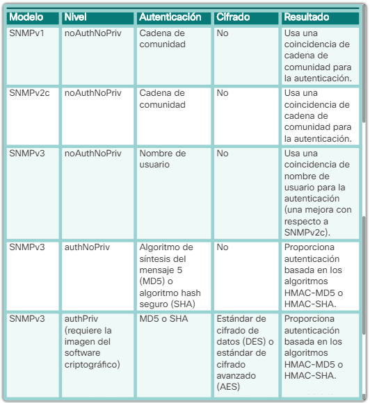

# Apunts SNMP
Apunts i proves sobre l'ús de llibreries Python per implementar el protocol SNMP.

## Recursos
[SNMP MIBs & SNMP OIDs explained](https://www.comparitech.com/net-admin/snmp-mibs-oids-explained/)
[Buscador de MIBs](https://mibbrowser.online/mibdb_search.php)
[Apunts Hackmd - SNMP](https://hackmd.io/XCIs0DjFSOGgErWf0935iA?view)

## Versions

    SNMPv1: el protocolo simple de administración de red, 
    un estándar de Internet completo, se define en RFC 1157.
    L'autenticació és mitjançant una cadena de comunitat.
    
    SNMPv2c: se define en las RFC 1901 a 1908; 
    utiliza el marco administrativo basado en cadenas de
    comunidad. Aquí podem definir més d'una cadena  
    i cadascuna pot tenir els seus permisos. S'afegeix
    la possibilitat d'obtenir blocs d'informació amb 
    una única petició *get* (get-bulk-request)
    
    SNMPv3: protocolo interoperable basado en estándares 
    definido originalmente en las RFC 2273 a 2275; 
    proporciona acceso seguro mediante la autenticación 
    y el cifrado de paquetes a través de la red.



## MiB
Base de dades jeràrquica (estructurada). Per cada variable o dada de la base de dades es genera un OID.

Hi han molts tipus de MiB. Cada MiB té els seus propis OIDs. Hi han MiB per Cisco, per Linux, per Mikrotik, MiB que engloben uns tipus de dades, etc.

## OID
Un OID (Object Identifier) és una seqüència de números separats per punts (.) que representa una jerarquia d'objectes en SNMP.

L’estructura segueix un esquema jeràrquic definit per l'ISO (International Organization for Standardization) i l’IANA (Internet Assigned Numbers Authority). L'estructura general d'un OID seria com:

```bash
1.3.6.1.2.1.1.1.0
```

| OID	| Descripció |
|-----|------------|
|1	| ISO (International Organization for Standardization)|
|3	| Org (Organitzacions)|
|6	| DoD (Department of Defense) – Assigna l'espai per a Internet|
|1	| Internet – Defineix els objectes relacionats amb Internet|
|2	| Management – Per a gestió de xarxes (MIB-II)|
|1	| MIB-II – Conté objectes estàndards SNMP|

### 1.3.6.1 - Internet

| OID	| Descripció |
|-----|------------|
| 1.3.6.1.1	| Directory – Directori de serveis (poc usat)|
| 1.3.6.1.2	| Management – Per a SNMP i gestió de xarxes|
| 1.3.6.1.3	| Experimental – Per a investigació i proves|
| 1.3.6.1.4	| Private – Per a empreses i fabricants|
| 1.3.6.1.5	| Security – Per a protocols de seguretat|
| 1.3.6.1.6	| SNMPv2 – Definicions específiques de SNMPv2|

### 1.3.6.1.2 - Management

| OID	| Descripció |
|-----|------------|
| 1.3.6.1.2.1	| MIB-II – Conté objectes de xarxa comuns| 
| 1.3.6.1.2.2	| Objectes específics de gestió de xarxa| 

### 1.3.6.1.2.1 - Objectes de xarxa

| OID	| Descripció |
|-----|------------|
1.3.6.1.2.1.1	|system – Info del dispositiu (nom, ubicació, contacte)
1.3.6.1.2.1.2	|interfaces – Estat i configuració de les interfícies de xarxa
1.3.6.1.2.1.4	|ip – Configuració i estadístiques de l’IP
1.3.6.1.2.1.6	|tcp – Estat de les connexions TCP
1.3.6.1.2.1.7	|udp – Estadístiques UDP
1.3.6.1.2.1.11	|snmp – Estadístiques sobre el mateix SNMP
1.3.6.1.2.1.17	|dot1dBridge – Taula MAC
1.3.6.1.2.1.5	|icmp – Estadístiques de paquets ICMP

### 1.3.6.1.4 - Private

Aquesta branca conté objectes definits per fabricants i empreses. Cada empresa té el seu espai reservat. Exemple:

OID	|Empresa/Fabricant
|-----|------------|
1.3.6.1.4.1.9	|Cisco
1.3.6.1.4.1.11	|HP
1.3.6.1.4.1.8072	|Net-SNMP (implementació SNMP per a Linux)

Per exemple, si el que vull és informació bàsica estàndard (aplicable a qualsevol switch de qualsevol fabricant), He d'anar a 1.3.6.1.2.1 (MIB-II). Si, en canvi, vull informació específica del fabricant (estat de ports, VLANs, configuració avançada), he d'anar a 1.3.6.1.4.1 (Private Enterprises MIBs).